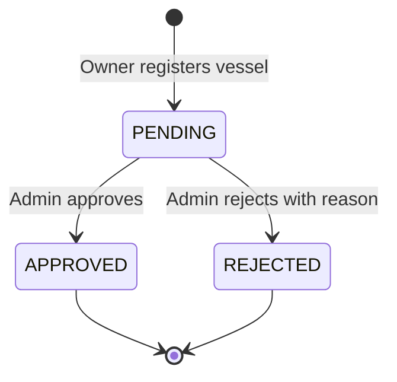
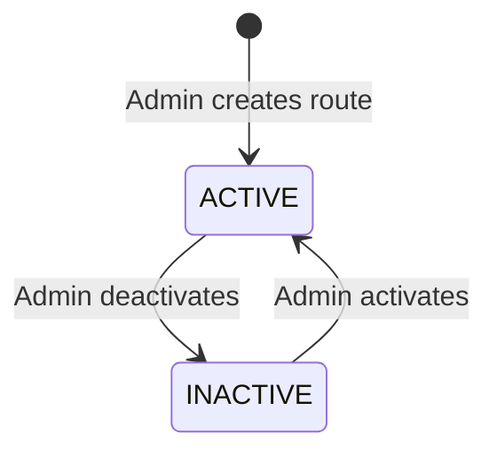
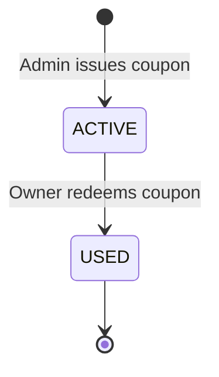
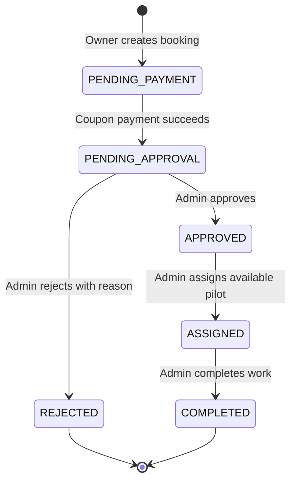
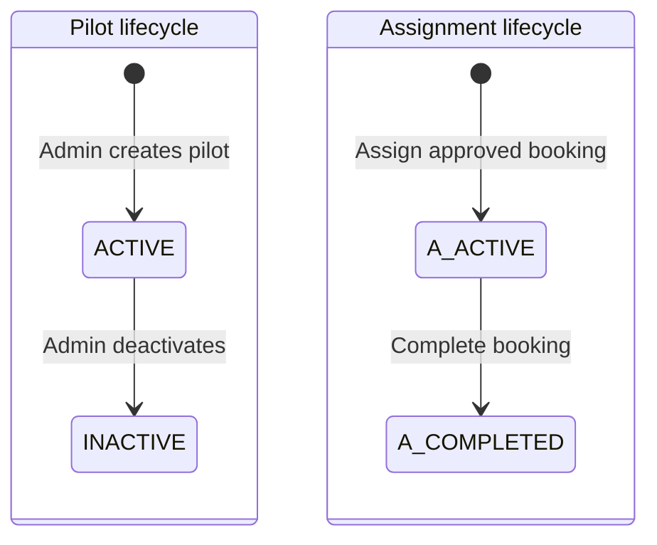

# Business Flow

## Purpose and actors

The system manages the lifecycle of a maritime pilotage booking paid with an administrator-issued coupon.

There are two roles:

- **OWNER** registers an account and vessels, browses active routes, receives and redeems coupons, creates bookings, and tracks booking progress.
- **ADMIN** reviews vessels and bookings, manages routes and pilots, issues coupons, assigns pilots, completes bookings, views reports, and monitors aggregate dashboards.

Registration is intentionally owner-only. Administrator accounts are provisioned operationally; there is no public administrator-registration endpoint.

## End-to-end happy path

```mermaid
sequenceDiagram
    autonumber
    actor Owner
    actor Admin
    participant API as Spring Boot API
    participant DB as PostgreSQL 18

    Owner->>API: Register and log in
    API->>DB: Create ACTIVE user with OWNER role
    API-->>Owner: JWT access token

    Owner->>API: Register vessel
    API->>DB: Create vessel (PENDING)
    Admin->>API: Approve vessel
    API->>DB: Vessel -> APPROVED

    Admin->>API: Create active route
    API->>DB: Persist route and service fee
    Admin->>API: Issue coupon to owner
    API->>DB: Create coupon (ACTIVE)

    Owner->>API: Create booking with vessel, route, future date
    API->>DB: Snapshot route fee; booking -> PENDING_PAYMENT
    Owner->>API: Redeem coupon for booking
    API->>DB: Payment SUCCESS + redemption + coupon USED
    API->>DB: Booking -> PENDING_APPROVAL

    Admin->>API: Approve booking
    API->>DB: Booking -> APPROVED
    Admin->>API: Create/select available ACTIVE pilot
    Admin->>API: Assign pilot
    API->>DB: Assignment ACTIVE + booking ASSIGNED

    Owner->>API: Track booking
    API-->>Owner: Booking, payment, vessel, route, and pilot summary
    Admin->>API: Complete booking
    API->>DB: Assignment COMPLETED + booking COMPLETED

    Owner->>API: Retrieve completed booking
    API-->>Owner: Completed state with historical pilot and payment
    Admin->>API: Query report/dashboard
    API-->>Admin: Read-only operational summary
```

## Vessel lifecycle



Rules:

- Registration numbers are globally unique.
- Only a `PENDING` vessel can receive a review decision.
- Review records the administrator, review time, and optional rejection reason.
- Only an `APPROVED` vessel owned by the authenticated owner can be used for a booking.
- Owner detail access is scoped by both vessel ID and owner ID; a vessel owned by another account is hidden as `404`.

## Route lifecycle



Rules:

- Route codes are globally unique and normalized to uppercase.
- Service fees must be positive and use two-decimal monetary precision.
- Owners can browse and retrieve only active routes.
- New bookings require an active route.
- A booking copies the route fee into `bookings.service_fee`; later route price changes do not rewrite the historical booking fee.

## Coupon and payment lifecycle



Coupon issuance and redemption rules:

- Coupons can be issued only to a user holding the `OWNER` role.
- Amount and expiry must be positive/future values.
- A coupon belongs to one owner and may be redeemed only by that owner.
- Redemption is allowed only while the coupon is `ACTIVE` and its expiry is still in the future.
- The coupon value must cover the full booking service fee. The implementation records exactly the booking fee as the redeemed amount.
- Redemption atomically creates a successful coupon payment, records the one-to-one coupon redemption, marks the coupon `USED`, and advances the booking to `PENDING_APPROVAL`.
- A partial unique index permits at most one `SUCCESS` payment per booking.
- Payment status is stored on `payments` and derived into booking/report responses. It is not duplicated on `bookings`.
- `EXPIRED` and `CANCELLED` are modeled coupon states, but the current REST API exposes no transition into them. Runtime redemption and dashboard availability checks still treat an `ACTIVE` coupon past `expires_at` as unavailable.

## Booking lifecycle



Transition rules:

| From | Action | To | Guard |
|---|---|---|---|
| — | Owner creates booking | `PENDING_PAYMENT` | Future service date, owned approved vessel, active route |
| `PENDING_PAYMENT` | Owner pays with coupon | `PENDING_APPROVAL` | Redeemable owned coupon covers snapshotted fee |
| `PENDING_APPROVAL` | Admin approves | `APPROVED` | Booking has not already received a decision |
| `PENDING_APPROVAL` | Admin rejects | `REJECTED` | Nonblank reason, maximum 1000 characters |
| `APPROVED` | Admin assigns pilot | `ASSIGNED` | Pilot active and available on service date; no active assignment |
| `ASSIGNED` | Admin completes | `COMPLETED` | A matching active assignment exists |

The owner booking-detail response provides:

- booking number, lifecycle status, service date, and snapshotted service fee;
- vessel and route summaries;
- the successful payment summary when one exists;
- the latest assignment and pilot summary when one exists;
- completion timestamp when completed.

Payment and assignment absence is represented by `null`, preventing a pending or merely approved booking from falsely showing successful payment or a pilot. The latest assignment is retained after completion, so historical pilot information remains visible.

## Pilot and assignment lifecycle



Rules:

- Employee numbers are globally unique and normalized to uppercase.
- Only an `ACTIVE` pilot can be assigned.
- A pilot with an active assignment cannot be deactivated.
- An availability query returns active pilots without an active assignment on the requested date.
- Partial unique indexes enforce one active assignment per booking and one active assignment per pilot per service date, including under concurrent requests.
- Assignment does not change the pilot lifecycle status; an assigned pilot remains `ACTIVE`.
- Completion changes both the booking and its active assignment to `COMPLETED` in one transaction.
- `CANCELLED` is modeled as an assignment status, but the current REST API exposes no cancellation transition.

## Reporting and dashboards

### Owner dashboard

The owner dashboard is scoped to the authenticated owner and reports:

- vessel counts by status;
- booking counts by status;
- coupon counts by status;
- count and total value of unexpired `ACTIVE` coupons.

### Admin dashboard

The admin dashboard reports system-wide:

- vessel counts by status;
- booking counts by status;
- coupon counts by status;
- pilot counts by status;
- total coupon value redeemed through successful payments.

### Admin booking report

The read-only booking report is paginated and supports combinable filters:

- booking status;
- inclusive `from` and `to` service dates;
- route ID;
- pilot ID.

Each row includes the booking number, owner name, vessel name and registration, route code and name, service date, snapshotted fee, booking status, payment status derived from `payments`, and pilot name. An invalid range where `from > to` returns `400`; no matches return an empty page.

## Alternate and rejected flows

- A vessel review or booking review cannot be repeated after a final decision; the API returns `409 Conflict`.
- Unpaid bookings cannot be approved or rejected.
- Reusing a coupon, using another owner's coupon, using an expired coupon, or using an insufficient coupon is rejected.
- A booking cannot be paid twice, assigned before approval, assigned twice, or completed before assignment.
- An inactive or already-booked pilot cannot be assigned.
- Optimistic locking protects review and pilot-update operations; database uniqueness protects concurrent payment and assignment races.
- Owner collection and detail APIs never expose another owner's vessels, bookings, or coupons.
