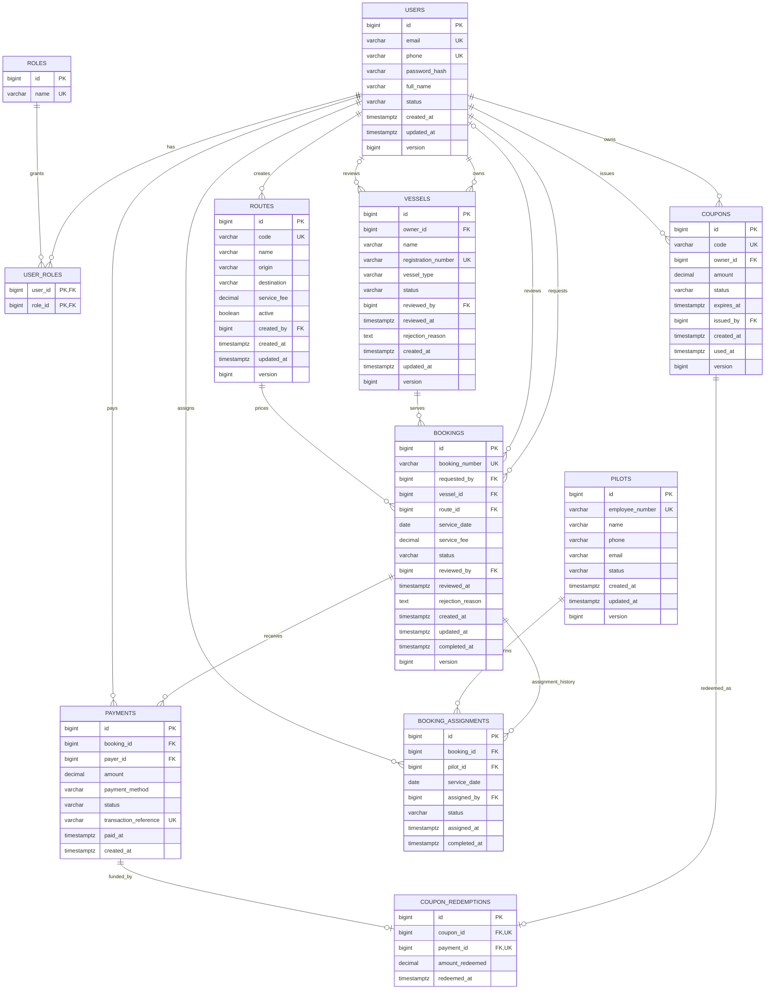

# Schema Design

## Overview

The application uses PostgreSQL 18. Flyway owns the schema through migrations `V1`–`V9`, and Hibernate runs with `ddl-auto: validate`; application startup validates mappings but does not create or alter production tables.

The schema contains eleven business tables:

```text
users, roles, user_roles, vessels, routes, coupons,
bookings, payments, coupon_redemptions, pilots, booking_assignments
```

Design goals:

- normalize identities, resources, payments, and assignments;
- keep workflow status in the aggregate that owns it;
- retain historical booking fee, payment, redemption, and assignment facts;
- enforce critical monetary, lifecycle, uniqueness, and concurrency invariants in PostgreSQL;
- optimize owner/admin filtered collections and deterministic newest-first pagination.

## Mermaid ERD



## Table catalog

### `users`

Stores authenticated identities.

| Column | Type | Null | Notes |
|---|---|---:|---|
| `id` | `bigint identity` | No | Primary key |
| `email` | `varchar(255)` | No | Globally unique; normalized by application |
| `phone` | `varchar(50)` | Yes | Globally unique when present |
| `password_hash` | `varchar(255)` | No | Delegating password-encoder output; never exposed by API |
| `full_name` | `varchar(150)` | No | Display/reporting name |
| `status` | `varchar(30)` | No | `ACTIVE`, `DISABLED` |
| `created_at` | `timestamptz` | No | Creation audit time |
| `updated_at` | `timestamptz` | No | Last update time |
| `version` | `bigint` | No | JPA optimistic-lock version |

### `roles` and `user_roles`

`roles` contains the seeded role names `OWNER` and `ADMIN`. `user_roles` is the many-to-many join with composite primary key `(user_id, role_id)`, preventing duplicate grants.

| Table | Column | Type | Relationship / rule |
|---|---|---|---|
| `roles` | `id` | `bigint identity` | Primary key |
| `roles` | `name` | `varchar(30)` | Unique; `OWNER` or `ADMIN` |
| `user_roles` | `user_id` | `bigint` | FK to `users.id`; composite PK |
| `user_roles` | `role_id` | `bigint` | FK to `roles.id`; composite PK |

### `vessels`

| Column | Type | Null | Notes |
|---|---|---:|---|
| `id` | `bigint identity` | No | Primary key |
| `owner_id` | `bigint` | No | FK to `users.id` |
| `name` | `varchar(150)` | No | Vessel display name |
| `registration_number` | `varchar(100)` | No | Globally unique |
| `vessel_type` | `varchar(80)` | No | Domain description |
| `status` | `varchar(30)` | No | `PENDING`, `APPROVED`, `REJECTED` |
| `reviewed_by` | `bigint` | Yes | FK to administrator in `users.id` |
| `reviewed_at` | `timestamptz` | Yes | Review audit time |
| `rejection_reason` | `text` | Yes | Present for rejection |
| `created_at`, `updated_at` | `timestamptz` | No | Audit timestamps |
| `version` | `bigint` | No | Optimistic-lock version |

### `routes`

| Column | Type | Null | Notes |
|---|---|---:|---|
| `id` | `bigint identity` | No | Primary key |
| `code` | `varchar(30)` | No | Globally unique, uppercase-normalized |
| `name` | `varchar(150)` | No | Route display name |
| `origin`, `destination` | `varchar(100)` | No | Route endpoints |
| `service_fee` | `numeric(12,2)` | No | Must be greater than zero |
| `active` | `boolean` | No | Defaults to `true` |
| `created_by` | `bigint` | No | FK to administrator in `users.id` |
| `created_at`, `updated_at` | `timestamptz` | No | Audit timestamps |
| `version` | `bigint` | No | Optimistic-lock version |

### `coupons`

| Column | Type | Null | Notes |
|---|---|---:|---|
| `id` | `bigint identity` | No | Primary key |
| `code` | `varchar(80)` | No | Generated globally unique redemption code |
| `owner_id` | `bigint` | No | FK to eligible owner in `users.id` |
| `amount` | `numeric(12,2)` | No | Must be greater than zero |
| `status` | `varchar(30)` | No | `ACTIVE`, `USED`, `EXPIRED`, `CANCELLED` |
| `expires_at` | `timestamptz` | No | Must be after `created_at` |
| `issued_by` | `bigint` | No | FK to administrator in `users.id` |
| `created_at` | `timestamptz` | No | Issuance time |
| `used_at` | `timestamptz` | Yes | Redemption time |
| `version` | `bigint` | No | Optimistic-lock version |

### `bookings`

| Column | Type | Null | Notes |
|---|---|---:|---|
| `id` | `bigint identity` | No | Primary key |
| `booking_number` | `varchar(80)` | No | Generated globally unique business identifier |
| `requested_by` | `bigint` | No | FK to owner in `users.id` |
| `vessel_id` | `bigint` | No | FK to `vessels.id` |
| `route_id` | `bigint` | No | FK to `routes.id` |
| `service_date` | `date` | No | Immutable requested service date |
| `service_fee` | `numeric(12,2)` | No | Positive immutable snapshot of route fee |
| `status` | `varchar(40)` | No | Booking lifecycle status |
| `reviewed_by` | `bigint` | Yes | FK to administrator in `users.id` |
| `reviewed_at` | `timestamptz` | Yes | Approval/rejection time |
| `rejection_reason` | `text` | Yes | Present for rejection |
| `created_at`, `updated_at` | `timestamptz` | No | Audit timestamps |
| `completed_at` | `timestamptz` | Yes | Terminal completion time |
| `version` | `bigint` | No | Optimistic-lock version |

Allowed statuses are `PENDING_PAYMENT`, `PENDING_APPROVAL`, `APPROVED`, `REJECTED`, `ASSIGNED`, and `COMPLETED`.

### `payments`

| Column | Type | Null | Notes |
|---|---|---:|---|
| `id` | `bigint identity` | No | Primary key |
| `booking_id` | `bigint` | No | FK to `bookings.id` |
| `payer_id` | `bigint` | No | FK to owner in `users.id` |
| `amount` | `numeric(12,2)` | No | Must be greater than zero |
| `payment_method` | `varchar(30)` | No | Currently `COUPON` only |
| `status` | `varchar(30)` | No | `PENDING`, `SUCCESS`, `FAILED` |
| `transaction_reference` | `varchar(100)` | No | Generated globally unique reference |
| `paid_at` | `timestamptz` | Yes | Successful payment time |
| `created_at` | `timestamptz` | No | Creation time |

Payment status is authoritative here. Booking detail and report queries derive it from `payments`; there is deliberately no `payment_status` column on `bookings`.

### `coupon_redemptions`

| Column | Type | Null | Notes |
|---|---|---:|---|
| `id` | `bigint identity` | No | Primary key |
| `coupon_id` | `bigint` | No | Unique FK to `coupons.id` |
| `payment_id` | `bigint` | No | Unique FK to `payments.id` |
| `amount_redeemed` | `numeric(12,2)` | No | Must be greater than zero |
| `redeemed_at` | `timestamptz` | No | Immutable redemption audit time |

Unique foreign keys model a one-to-zero-or-one redemption from both coupon and payment perspectives.

### `pilots`

| Column | Type | Null | Notes |
|---|---|---:|---|
| `id` | `bigint identity` | No | Primary key |
| `employee_number` | `varchar(80)` | No | Globally unique, uppercase-normalized |
| `name` | `varchar(150)` | No | Pilot display name |
| `phone` | `varchar(50)` | Yes | Contact detail |
| `email` | `varchar(255)` | Yes | Contact detail; not a login identity |
| `status` | `varchar(30)` | No | `ACTIVE`, `INACTIVE` |
| `created_at`, `updated_at` | `timestamptz` | No | Audit timestamps |
| `version` | `bigint` | No | Optimistic-lock version exposed for update |

### `booking_assignments`

| Column | Type | Null | Notes |
|---|---|---:|---|
| `id` | `bigint identity` | No | Primary key |
| `booking_id` | `bigint` | No | FK to `bookings.id` |
| `pilot_id` | `bigint` | No | FK to `pilots.id` |
| `service_date` | `date` | No | Assignment-time snapshot used for scheduling |
| `assigned_by` | `bigint` | No | FK to administrator in `users.id` |
| `status` | `varchar(30)` | No | `ACTIVE`, `COMPLETED`, `CANCELLED` |
| `assigned_at` | `timestamptz` | No | Assignment audit time |
| `completed_at` | `timestamptz` | Yes | Completion audit time |

Multiple historical assignments can exist for a booking, but only one can be active.

## Integrity and concurrency constraints

### Check constraints

- Every lifecycle column is restricted to its defined enum values.
- Route fees, coupon amounts, booking fees, payment amounts, and redeemed amounts must be positive.
- Coupon expiry must be after coupon creation.

### Unique business keys

- User email and optional phone.
- Role name.
- Vessel registration number.
- Route code.
- Coupon code.
- Booking number.
- Payment transaction reference.
- Pilot employee number.
- One redemption per coupon and per payment.

### Partial unique indexes

```sql
create unique index uq_successful_payment_per_booking
    on payments (booking_id)
    where status = 'SUCCESS';

create unique index uq_active_assignment_per_booking
    on booking_assignments (booking_id)
    where status = 'ACTIVE';

create unique index uq_active_pilot_per_service_date
    on booking_assignments (pilot_id, service_date)
    where status = 'ACTIVE';
```

These constraints close race windows even when concurrent application requests pass precondition checks simultaneously.

### Optimistic and pessimistic coordination

- Version columns support optimistic locking on mutable aggregates such as users, vessels, routes, coupons, bookings, and pilots.
- Payment redemption locks the owned booking and coupon before validating and changing state.
- Pilot assignment locks the booking and pilot before creating an assignment.
- Completion locks the booking and updates booking/assignment atomically.

## Query indexes

Collection indexes mirror the API's common filters and newest-first order:

| Index | Supports |
|---|---|
| `idx_vessels_owner_status_created` | Owner vessel filtering and pagination |
| `idx_vessels_status_created` | Admin vessel review queues |
| `idx_bookings_owner_status_created` | Owner booking filtering and pagination |
| `idx_bookings_status_created` | Admin booking review queues |
| `idx_coupons_owner_status_created` | Owner coupon filtering and pagination |
| `idx_coupons_status_created` | System-wide coupon status queries |
| `idx_routes_active_created` | Active route browsing |
| `idx_pilots_status_created` | Pilot lifecycle filtering |

Earlier supporting indexes on owner/status/ID remain in the migration history. PostgreSQL decides which index best serves each query.

## Historical data and derived views

- `bookings.service_fee` preserves the price agreed at booking creation even if the route changes later.
- `bookings.service_date` and `booking_assignments.service_date` preserve booking and scheduling history.
- `payments` and `coupon_redemptions` preserve monetary/audit facts independently of current coupon and booking state.
- Completed assignments remain stored and are used to expose historical pilot information.
- Report and dashboard responses are query projections; they do not require reporting tables or duplicated status columns.
